<div align="center">


<br />

[](https://www.linkedin.com/in/rudymizrahi/)
[](https://www.gradiahq.com)
[](https://orcid.org/0009-0000-7043-3766)
[](https://github.com/rudycelekli?tab=followers)

<br />

**Forward Deployed AI Researcher · Agentic AI Engineer**

<sub>Building verifiable, long-horizon agent environments · Enterprise AI & GTM</sub>

[Gradia](https://www.gradiahq.com) · [Snorkel AI](https://snorkel.ai/) · [Axiom Consulting](https://axiomconsulting.ai/)

</div>

<!-- top-contributor-proof:start -->
<div align="center">

**GitHub all-time Top-5 contributor at**

[**iFixAi**](https://github.com/ifixai-ai/iFixAi) `#1` · 22k ★ &nbsp;·&nbsp; [**agency-agents**](https://github.com/msitarzewski/agency-agents) `#2` · 158k ★ &nbsp;·&nbsp; [**MoneyPrinterTurbo**](https://github.com/harry0703/MoneyPrinterTurbo) `#2` · 129k ★ &nbsp;·&nbsp; [**claude-mem**](https://github.com/thedotmack/claude-mem) `#2` · 98k ★ &nbsp;·&nbsp; [**Ruflo**](https://github.com/ruvnet/ruflo) `#2` · 74k ★ &nbsp;·&nbsp; [**marketingskills**](https://github.com/coreyhaines31/marketingskills) `#2` · 54k ★ &nbsp;·&nbsp; [**openrig**](https://github.com/mvschwarz/openrig) `#2` · 5.8k ★ &nbsp;·&nbsp; [**open-dots**](https://github.com/Anil-matcha/open-dots) `#2` · 5.5k ★ &nbsp;·&nbsp; [**Agentic-QE**](https://github.com/proffesor-for-testing/agentic-qe) `#2` · 494 ★ &nbsp;·&nbsp; [**imajev**](https://github.com/mohit67890/imajev) `#2` · 336 ★ &nbsp;·&nbsp; [**OpenGTM**](https://github.com/debpalash/OpenGTM) `#2` · 41 ★ &nbsp;·&nbsp; [**Peekaboo**](https://github.com/openclaw/Peekaboo) `#3` · 5.3k ★ &nbsp;·&nbsp; [**rea**](https://github.com/morluto/rea) `#4` · 15k ★ &nbsp;·&nbsp; [**e2e**](https://github.com/tester-army/e2e) `#5` · 7.4k ★

<sub>All-time rank from GitHub's Contributors API · repository stars are reach, not personal credit · refreshed 2026-10-07 UTC</sub>

</div>
<!-- top-contributor-proof:end -->

<!-- building-now:start -->
## Building now



**[Gradia](https://www.gradiahq.com)** for business-grounded AI agent evaluation: test real workflows and rules, inspect failures, and compare changes before release.

**Public frontier, selected automatically and shown in 2 rotating views:**

1. **[code-transplant](https://github.com/rudycelekli/code-transplant)** · [v0.1.0 pre-release](https://github.com/rudycelekli/code-transplant/releases/tag/v0.1.0): Gradia Research: move TypeScript parsers between programs with dependency capsules and reproducible behavioral evidence.
2. **[Gradia Guard](https://github.com/rudycelekli/gradia-guard)** · [source-v0.1.0-beta.8 pre-release](https://github.com/rudycelekli/gradia-guard/releases/tag/source-v0.1.0-beta.8): Open-source, proof-bound evidence recorder and verifier for explicit AI-system execution boundaries.
3. **[TestLore](https://github.com/rudycelekli/testlore)**: Build better tests. Run what matters. Remember what worked. An open-source test intelligence and quality engineering layer.
4. **[Kin Connect](https://github.com/rudycelekli/kin-connect)** · [v0.2.1 pre-release](https://github.com/rudycelekli/kin-connect/releases/tag/v0.2.1): Your agent. Your people. Open-source agent-to-agent introductions for friendship, dating, and collaboration.
5. **[gradia-lens](https://github.com/rudycelekli/gradia-lens)** · [v0.1.0a1 pre-release](https://github.com/rudycelekli/gradia-lens/releases/tag/v0.1.0a1): Open-model intervention research by Gradia: inspect computation, change components, measure side effects, restore and replay.
6. **[scrapmind](https://github.com/rudycelekli/scrapmind)** · [v0.1.0-alpha.8 pre-release](https://github.com/rudycelekli/scrapmind/releases/tag/v0.1.0-alpha.8): Invent with what you have. Inventory-constrained planning, adaptive builds, and Device Alchemy for spare materials and devices.

<sub>Public selections are re-evaluated every 30 minutes from GitHub reach, shipping and release recency, attributed work, and project completeness · last ranked 2026-10-07 UTC · Gradia is intentionally separate because its private repository evidence remains private</sub>
<!-- building-now:end -->

## Watch the operating brief



<sub>35 seconds · seven chapters · live evidence · reduced-motion safe · narrative format inspired by [RuVector’s vector walkthrough](https://github.com/ruvnet/ruvector/blob/main/assets/ruvector/ruvector-walkthrough.md)</sub>

[Inspect public proof](#open-source-impact-verified) · [Explore the proof stack](#the-proof-stack) · [Audit Agentic Power](#agentic-power-engineered) · [Meet the human layer](#building-the-human-layer)

## Intelligence is cheap. Evidence is the product.

I’m a forward deployed AI researcher and agentic AI engineer building systems that make autonomous behavior **observable, replayable, and independently verifiable**.

My work sits where agent infrastructure meets experimental science: record what happened, challenge the evaluator, preserve the evidence, and make every important claim reproducible by someone else.


<!-- contribution-stats:start -->
## Open-source impact, verified

My upstream work is discovered automatically across public repositories outside my account. A project enters when GitHub proves accepted work through an authored merged PR on any upstream branch or an authored commit on the default branch. **GitHub-listed contributor** is the highest attribution tier and is applied automatically when GitHub's Contributors API catches up. Stars and forks describe repository reach, not personal credit.


| Project and evidence | Attributed commits | Merged PRs | Accepted lines (+ / −) | Files | Repository reach |
|:--|--:|--:|--:|--:|--:|
| **[MoneyPrinterTurbo](https://github.com/harry0703/MoneyPrinterTurbo)** · [GitHub-listed contributor](https://github.com/harry0703/MoneyPrinterTurbo/graphs/contributors) | 151 | [151](https://github.com/harry0703/MoneyPrinterTurbo/pulls?q=is%3Apr+author%3Arudycelekli+is%3Amerged) | +13,023 / −938 | 358 | 129,116 ★ · 20,208 forks |
| **[openrig](https://github.com/mvschwarz/openrig)** · [GitHub-listed contributor](https://github.com/mvschwarz/openrig/graphs/contributors) | 145 | [145](https://github.com/mvschwarz/openrig/pulls?q=is%3Apr+author%3Arudycelekli+is%3Amerged) | +12,515 / −1,045 | 421 | 5,754 ★ · 428 forks |
| **[claude-mem](https://github.com/thedotmack/claude-mem)** · [GitHub-listed contributor](https://github.com/thedotmack/claude-mem/graphs/contributors) | 144 | [143](https://github.com/thedotmack/claude-mem/pulls?q=is%3Apr+author%3Arudycelekli+is%3Amerged) | +20,450 / −1,744 | 582 | 97,676 ★ · 8,601 forks |
| **[agency-agents](https://github.com/msitarzewski/agency-agents)** · [GitHub-listed contributor](https://github.com/msitarzewski/agency-agents/graphs/contributors) | 138 | [126](https://github.com/msitarzewski/agency-agents/pulls?q=is%3Apr+author%3Arudycelekli+is%3Amerged) | +2,540 / −783 | 161 | 158,242 ★ · 25,500 forks |
| **[Agentic-QE](https://github.com/proffesor-for-testing/agentic-qe)** · [GitHub-listed contributor](https://github.com/proffesor-for-testing/agentic-qe/graphs/contributors) | 132 | [81](https://github.com/proffesor-for-testing/agentic-qe/pulls?q=is%3Apr+author%3Arudycelekli+is%3Amerged) | +15,764 / −2,508 | 391 | 494 ★ · 98 forks |
| **[iFixAi](https://github.com/ifixai-ai/iFixAi)** · [GitHub-listed contributor](https://github.com/ifixai-ai/iFixAi/graphs/contributors) | 74 | [74](https://github.com/ifixai-ai/iFixAi/pulls?q=is%3Apr+author%3Arudycelekli+is%3Amerged) | +6,650 / −432 | 182 | 22,300 ★ · 1,418 forks |
| **[rea](https://github.com/morluto/rea)** · [GitHub-listed contributor](https://github.com/morluto/rea/graphs/contributors) | 65 | [65](https://github.com/morluto/rea/pulls?q=is%3Apr+author%3Arudycelekli+is%3Amerged) | +6,902 / −395 | 218 | 14,699 ★ · 1,542 forks |
| **[Ruflo](https://github.com/ruvnet/ruflo)** · [GitHub-listed contributor](https://github.com/ruvnet/ruflo/graphs/contributors) | 107 | [59](https://github.com/ruvnet/ruflo/pulls?q=is%3Apr+author%3Arudycelekli+is%3Amerged) | +7,098 / −909 | 222 | 74,068 ★ · 8,807 forks |
| **[CowAgent](https://github.com/zhayujie/CowAgent)** · [GitHub-listed contributor](https://github.com/zhayujie/CowAgent/graphs/contributors) | 57 | [55](https://github.com/zhayujie/CowAgent/pulls?q=is%3Apr+author%3Arudycelekli+is%3Amerged) | +4,739 / −471 | 118 | 47,267 ★ · 10,377 forks |
| **[Peekaboo](https://github.com/openclaw/Peekaboo)** · [GitHub-listed contributor](https://github.com/openclaw/Peekaboo/graphs/contributors) | 46 | [46](https://github.com/openclaw/Peekaboo/pulls?q=is%3Apr+author%3Arudycelekli+is%3Amerged) | +5,749 / −805 | 234 | 5,259 ★ · 411 forks |
| **[OpenGTM](https://github.com/debpalash/OpenGTM)** · [GitHub-listed contributor](https://github.com/debpalash/OpenGTM/graphs/contributors) | 39 | [38](https://github.com/debpalash/OpenGTM/pulls?q=is%3Apr+author%3Arudycelekli+is%3Amerged) | +3,182 / −171 | 103 | 41 ★ · 11 forks |
| **[marketingskills](https://github.com/coreyhaines31/marketingskills)** · [GitHub-listed contributor](https://github.com/coreyhaines31/marketingskills/graphs/contributors) | 29 | [26](https://github.com/coreyhaines31/marketingskills/pulls?q=is%3Apr+author%3Arudycelekli+is%3Amerged) | +1,438 / −110 | 72 | 53,590 ★ · 7,969 forks |
| **[hindsight](https://github.com/vectorize-io/hindsight)** · [GitHub-listed contributor](https://github.com/vectorize-io/hindsight/graphs/contributors) | 24 | [24](https://github.com/vectorize-io/hindsight/pulls?q=is%3Apr+author%3Arudycelekli+is%3Amerged) | +1,546 / −116 | 58 | 46,790 ★ · 5,957 forks |
| **[colibri](https://github.com/JustVugg/colibri)** · [GitHub-listed contributor](https://github.com/JustVugg/colibri/graphs/contributors) | 39 | [21](https://github.com/JustVugg/colibri/pulls?q=is%3Apr+author%3Arudycelekli+is%3Amerged) | +1,486 / −77 | 78 | 40,312 ★ · 4,432 forks |
| **[VoiceStudio](https://github.com/debpalash/VoiceStudio)** · [GitHub-listed contributor](https://github.com/debpalash/VoiceStudio/graphs/contributors) | 38 | [18](https://github.com/debpalash/VoiceStudio/pulls?q=is%3Apr+author%3Arudycelekli+is%3Amerged) | +2,522 / −134 | 78 | 54,666 ★ · 6,133 forks |
| **[e2e](https://github.com/tester-army/e2e)** · [GitHub-listed contributor](https://github.com/tester-army/e2e/graphs/contributors) | 11 | [11](https://github.com/tester-army/e2e/pulls?q=is%3Apr+author%3Arudycelekli+is%3Amerged) | +487 / −47 | 51 | 7,371 ★ · 332 forks |
| **[Vibe-Trading](https://github.com/HKUDS/Vibe-Trading)** · [GitHub-listed contributor](https://github.com/HKUDS/Vibe-Trading/graphs/contributors) | 13 | [8](https://github.com/HKUDS/Vibe-Trading/pulls?q=is%3Apr+author%3Arudycelekli+is%3Amerged) | +550 / −34 | 23 | 34,936 ★ · 5,665 forks |
| **[open-dots](https://github.com/Anil-matcha/open-dots)** · [GitHub-listed contributor](https://github.com/Anil-matcha/open-dots/graphs/contributors) | 10 | [8](https://github.com/Anil-matcha/open-dots/pulls?q=is%3Apr+author%3Arudycelekli+is%3Amerged) | +1,123 / −48 | 21 | 5,512 ★ · 657 forks |
| **[benchmark-radar](https://github.com/ktwu01/benchmark-radar)** · [GitHub-listed contributor](https://github.com/ktwu01/benchmark-radar/graphs/contributors) | 4 | [3](https://github.com/ktwu01/benchmark-radar/pulls?q=is%3Apr+author%3Arudycelekli+is%3Amerged) | +238 / −16 | 10 | 283 ★ · 46 forks |
| **[openclaw](https://github.com/openclaw/openclaw)** · [Default-branch commit verified](https://github.com/openclaw/openclaw/commits?author=rudycelekli) | 2 | [2](https://github.com/openclaw/openclaw/pulls?q=is%3Apr+author%3Arudycelekli+is%3Amerged) | +448 / −14 | 6 | 391,597 ★ · 82,286 forks |
| **[agno](https://github.com/agno-agi/agno)** · [GitHub-listed contributor](https://github.com/agno-agi/agno/graphs/contributors) | 1 | [1](https://github.com/agno-agi/agno/pulls?q=is%3Apr+author%3Arudycelekli+is%3Amerged) | +332 / −6 | 2 | 42,603 ★ · 6,111 forks |
| **[imajev](https://github.com/mohit67890/imajev)** · [GitHub-listed contributor](https://github.com/mohit67890/imajev/graphs/contributors) | 1 | [1](https://github.com/mohit67890/imajev/pulls?q=is%3Apr+author%3Arudycelekli+is%3Amerged) | +164 / −2 | 4 | 336 ★ · 42 forks |
| **[hermes-agent](https://github.com/NousResearch/hermes-agent)** · [Default-branch commit verified](https://github.com/NousResearch/hermes-agent/commits?author=rudycelekli) | 4 | [0](https://github.com/NousResearch/hermes-agent/pulls?q=is%3Apr+author%3Arudycelekli+is%3Amerged) | — | — | 251,929 ★ · 54,251 forks |

### Public projects I own

Owned public source is a separate signal: GitHub lists me as the repository owner. These projects are discovered automatically from my public, non-fork, non-archived repositories, then ranked by stars, recent activity, and GitHub-attributed commits. Ownership is not counted as upstream contributor credit.


- **[ProofSeal](https://github.com/rudycelekli/proofseal)**: public owner repository with 13 GitHub-indexed commits. Repository reach: 4 stars and 0 forks; last pushed 2026-06-13.
- **[TestLore](https://github.com/rudycelekli/testlore)**: public owner repository with 185 GitHub-indexed commits. Repository reach: 2 stars and 0 forks; last pushed 2026-10-07.
- **[code-transplant](https://github.com/rudycelekli/code-transplant)**: public owner repository with 2 GitHub-indexed commits. Repository reach: 2 stars and 0 forks; last pushed 2026-10-07.
- **[Gradia Guard](https://github.com/rudycelekli/gradia-guard)**: public owner repository with 10 GitHub-indexed commits. Repository reach: 2 stars and 0 forks; last pushed 2026-10-06.
- **[Kin Connect](https://github.com/rudycelekli/kin-connect)**: public owner repository with 18 GitHub-indexed commits. Repository reach: 0 stars and 0 forks; last pushed 2026-10-07.
- **[open-teammates](https://github.com/rudycelekli/open-teammates)**: public owner repository with 2 GitHub-indexed commits. Repository reach: 0 stars and 0 forks; last pushed 2026-10-07.
- **[gradia-lens](https://github.com/rudycelekli/gradia-lens)**: public owner repository with 1 GitHub-indexed commit. Repository reach: 0 stars and 0 forks; last pushed 2026-10-07.
- **[scrapmind](https://github.com/rudycelekli/scrapmind)**: public owner repository with 8 GitHub-indexed commits. Repository reach: 0 stars and 0 forks; last pushed 2026-10-03.

<sub>Showing 8 of 24 qualifying owned public repositories · [browse every public source repository](https://github.com/rudycelekli?tab=repositories&type=source) · complete evidence retained in [machine-readable data](./data/contributions.json)</sub>

<sub>Last verified 2026-10-07 UTC · visual + evidence refreshed every 30 minutes by [GitHub Actions](./.github/workflows/refresh-contribution-stats.yml) · [machine-readable evidence](./data/contributions.json)</sub>
<!-- contribution-stats:end -->

## The proof stack

<table>
<tr>
<td width="50%" valign="top">

### 🛡️ [Gradia Guard](https://github.com/rudycelekli/gradia-guard)

Proof-bound evidence for AI execution. Records hash-chained decisions and actions, verifies them offline, and makes the boundary of every claim explicit.

`TypeScript` `Python` `AG-UI` `Cryptographic evidence`

</td>
<td width="50%" valign="top">

### 🌪️ [Gradia Wind Tunnel](https://github.com/rudycelekli/gradia-wind-tunnel)

An evaluation immune system. Finds reward-hacking exploits, isolates their causal slice, and tests whether scorer patches truly converge.

`Python` `Causal testing` `Offline replay` `DOI`

</td>
</tr>
<tr>
<td width="50%" valign="top">

### ⚖️ [The Value Engine Benchmark](https://github.com/rudycelekli/the-value-engine-benchmark)

An evidence-graded RL environment for multi-touch enterprise negotiation: **3,510 graded episodes**, **13 models**, and a fully reproducible methodology.

`TypeScript` `Python` `RLVR` `Evaluation`

</td>
<td width="50%" valign="top">

### 🔏 [ProofSeal](https://github.com/rudycelekli/proofseal)

Regression memory for coding agents. Seal behavioral claims once; check them over MCP or CI before a silent regression reaches history.

`JavaScript` `MCP` `CI` `Deterministic testing`

</td>
</tr>
</table>

## Agentic power, engineered

[Agentic Power](https://heroforge-agentic-power.artful-fly-4358.chatgpt.site/) asks a practical question: **how much accepted skilled work can one hour of human direction command?**

I design for that multiplier, but I won’t publish one without exposing its scope, evidence, assumptions, and uncertainty. My operating model is to delegate meaningful responsibility, compose the right tools and context, verify the result, then use the evidence to improve the next run.

<!-- agentic-power-profile:start -->
### Live Agentic Power snapshot


**AP ≈ 125.6× (operator-calibrated provisional estimate):** approximately 18,127.1 skilled Human-Equivalent Hours, or 453.2 engineer-weeks, divided by 144.3 operator-estimated human-direction hours. The transparent scenario range is 80.4× to 200.7×.

The evidence base since January 2025 combines **1,106 merged upstream PRs** with **6,532 authored, non-merge default-branch commits across 109 currently accessible repositories**: personal, private, employer, and open-source alike. Work such as Gradia is included only as a redacted aggregate: no repository names, commit messages, code, links, employer, or client details are published.

The conservative GitHub activity proxy produces 2,502.7 direction hours because it assigns attention to individual commits and repository-months. Operator recall is **1.5–2.0 active direction hours per week**; across 82.4 weeks, that calibrates the denominator to 123.7–164.9 hours, with 144.3 as the midpoint.

Direction includes active briefing, steering, reviewing, correcting, and coordinating. It excludes agent runtime and waiting. The calibration is operator-estimated rather than reconstructed from time logs, so this remains **a transparent scenario, not a completed Full Evidence Audit**.

<sub>[Framework and formula](https://heroforge-agentic-power.artful-fly-4358.chatgpt.site/) · [calculation evidence](./data/agentic-power.json) · public upstream evidence and visuals refreshed every 30 minutes; redacted repository snapshot retained until a private read credential is available</sub>
<!-- agentic-power-profile:end -->


- **Direct:** goals, constraints, acceptance criteria, and escalation rules stay explicit.
- **Orchestrate:** models, specialist agents, reusable skills, tools, memory, and loops become one working system.
- **Verify:** [Gradia Guard](https://github.com/rudycelekli/gradia-guard), [ProofSeal](https://github.com/rudycelekli/proofseal), and replayable evaluations separate completed work from plausible-looking activity.
- **Improve:** [Wind Tunnel](https://github.com/rudycelekli/gradia-wind-tunnel) and [Reward Loop](https://github.com/rudycelekli/gradia-reward-loop) turn measured failure into a better next run.

<sub>Framework concept by [Dr. Mark Allen / HeroForge.AI](https://heroforge-agentic-power.artful-fly-4358.chatgpt.site/). Visual and operating-model adaptation are original to this profile.</sub>

## What I’m exploring

```text
Can we trust the record?      → proof-bound execution evidence
Can we trust the score?       → adversarial evaluator stress testing
Can we reproduce the result?  → deterministic replay + committed artifacts
Can an agent remember?        → regression memory before commit
```

The thread through all of it is simple: **an AI system should be able to show its work without asking you to trust the AI system.**

## Working set

<div align="center">


</div>

## In the lab

- **[Gradia Universes](https://github.com/rudycelekli/gradia-universes-work-sample)** — proof-carrying, interruption-capable synthetic agent worlds with deterministic replay.
- **[Gradia Reward Loop](https://github.com/rudycelekli/gradia-reward-loop)** — oracle-witnessed reward-hacking experiments and a replay-verified paired-GRPO diagnostic.

## Building the human layer

I build communities as deliberately as systems. I lead [**AI Tinkerers Charlotte**](https://charlotte.aitinkerers.org/), a demo-first room for people shipping real AI systems, and serve as [**Regional Ambassador for the Agentics Foundation**](https://agentics.org/leadership/), connecting builders working on practical agentic AI.

---

<div align="center">

### Building AI that can survive contact with reality.

If you care about agent reliability, evaluation integrity, or evidence-first AI, explore the work and compare notes.

[**Connect on LinkedIn →**](https://www.linkedin.com/in/rudymizrahi/) &nbsp;&nbsp; [**Explore Gradia →**](https://www.gradiahq.com) &nbsp;&nbsp; [**Research record →**](https://orcid.org/0009-0000-7043-3766) &nbsp;&nbsp; [**Follow on GitHub →**](https://github.com/rudycelekli?tab=followers)

<sub>Based in Charlotte · working in public</sub>

</div>
